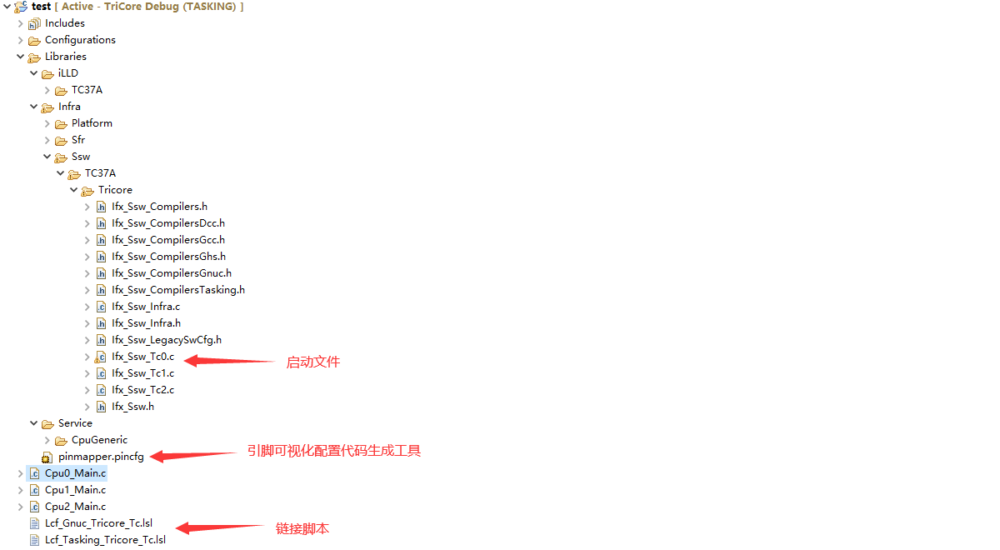
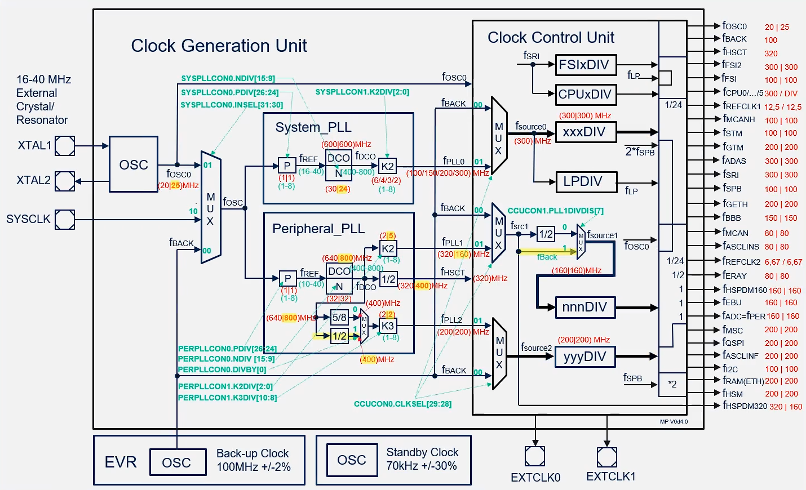
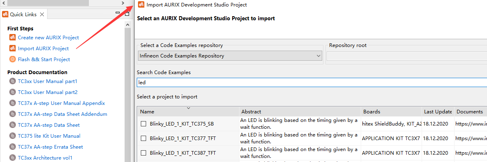
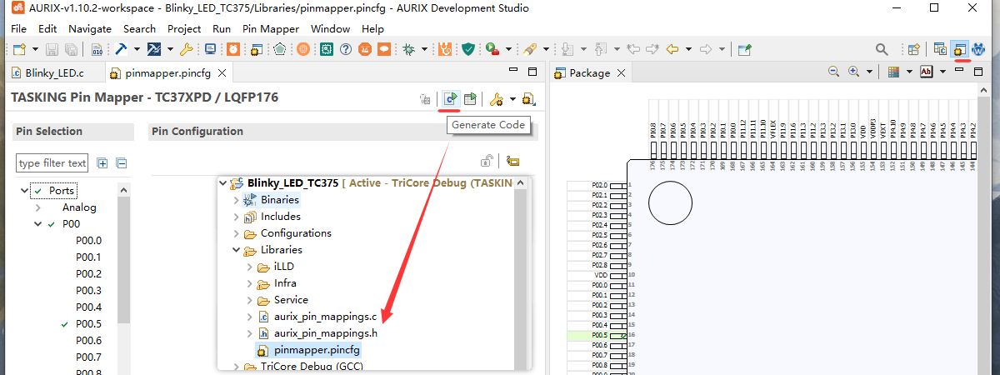
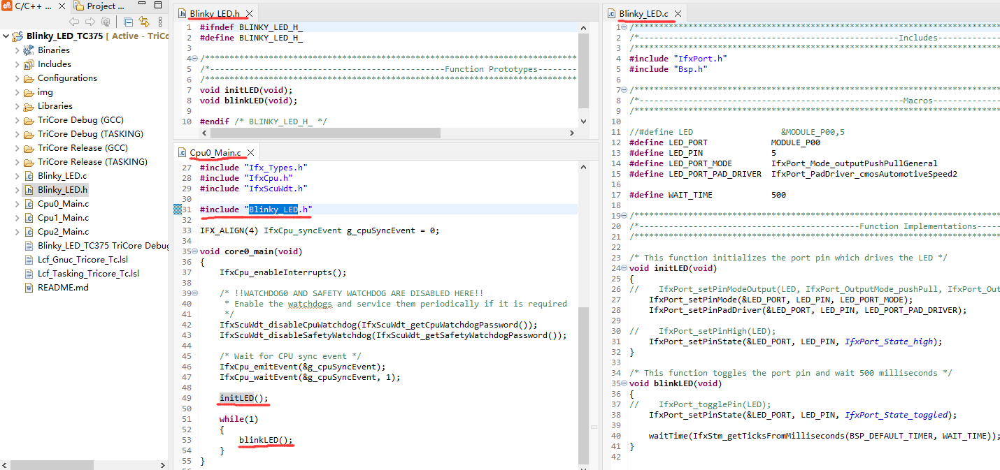

# Getting Started with AURIX by Example of Blinky_LED_TC375

## 目的

这个例程比较简单，主要通过这个例程来介绍 `AURIX™ Development Studio(ADS)` 和 `iLLD` 库来开发 `AURIX` 系列单片机一些入门的内容。一些更为基础的资料等内容可以参考下面文章：

[《英飞凌 AURIX TriCore 单片机开发入门》](https://blog.csdn.net/Naisu_kun/article/details/136997615)

本文中例程基于英飞凌官方 [KIT_A2G_TC375_LITE](https://www.infineon.com/cms/en/product/evaluation-boards/kit_a2g_tc375_lite/) 开发板运行测试。


## 模板工程

在 `ADS` 中 `Create New AURIX Project` 后选择对应的芯片就会生成该芯片的模板工程。模板工程目录结构如下：



模板工程中东西很多，入门点个灯的话大部分不用关心，随便找个 `Cpux_Main.c` 写代码就行。

稍微需要注意的是外部晶体频率的配置，在 `Ifx_Cfg.h` 文件中：


在默认模板工程的启动文件中会去设置系统的各个部分时钟，默认情况下这些时钟都是会设置成可设置的最大值的：




## Blinky_LED

这里说的 `Blinky_LED` 指的是将用单片机一个引脚设置为输出模式来驱动 `LED` 。

英飞凌官方提供了 `Blinky_LED` 的例程，可以直接导入运行：




通过 `Pin Mapper` 工具配置对应的引脚，生成初始化代码：




本示例代码如下：



```c
#include "IfxPort.h"
#include "Bsp.h"

#define LED_PORT             MODULE_P00
#define LED_PIN              5
#define LED_PORT_MODE        IfxPort_Mode_outputPushPullGeneral
#define LED_PORT_PAD_DRIVER  IfxPort_PadDriver_cmosAutomotiveSpeed2

#define WAIT_TIME            500

void initLED(void)
{
    // 设置 P00.5 为推挽输出模式
    IfxPort_setPinMode(&LED_PORT, LED_PIN, LED_PORT_MODE);
    // 设置 P00.5 为cmos电平、启动能力2(Strong driver, medium edge (“sm”))
    IfxPort_setPinPadDriver(&LED_PORT, LED_PIN, LED_PORT_PAD_DRIVER);

    // 设置 P00.5 输出高电平(根据开发板上这个LED的接法，这会熄灭LED)
    IfxPort_setPinState(&LED_PORT, LED_PIN, IfxPort_State_high);
}

void blinkLED(void)
{
    // 翻转 P00.5 输出电平
    IfxPort_setPinState(&LED_PORT, LED_PIN, IfxPort_State_toggled);

    // 等待 500ms
    waitTime(IfxStm_getTicksFromMilliseconds(BSP_DEFAULT_TIMER, WAIT_TIME));
}
```

英飞凌的 `iLLD` 库中对同一个事情的操作封装了非常多的函数，对于本例程中IO操作就有下面好多：

```c
void IfxPort_setPinModeOutput(Ifx_P *port, uint8 pinIndex, IfxPort_OutputMode mode, IfxPort_OutputIdx index)

void IfxPort_setPinHigh(Ifx_P *port, uint8 pinIndex)
void IfxPort_setPinLow(Ifx_P *port, uint8 pinIndex)
void IfxPort_togglePin(Ifx_P *port, uint8 pinIndex)
```


## 总结

这里只是简单进行了下介绍，上面的内容如果要展开来说的话其实可以讲非常多的内容，这里就不再展开来介绍了。如果对电源、时钟、启动等细节内容感兴趣的也可以参考英飞凌官方的视频介绍：

[《AURIX™ TC3xx 进阶培训》https://www.bilibili.com/video/BV12W4y1M7UB](https://www.bilibili.com/video/BV12W4y1M7UB)

  
