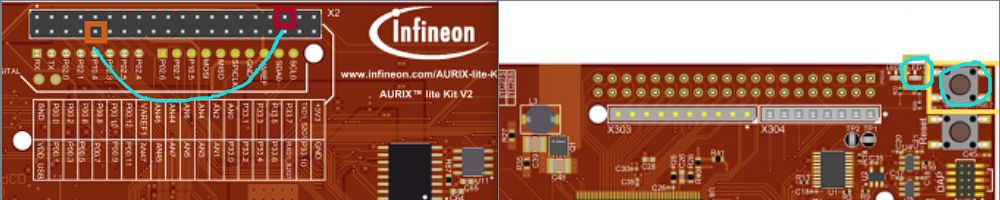
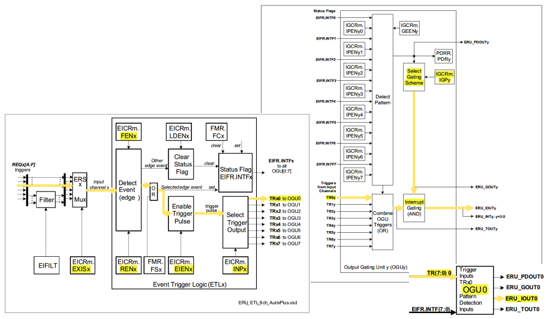
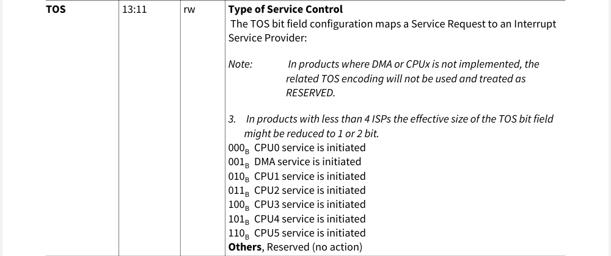
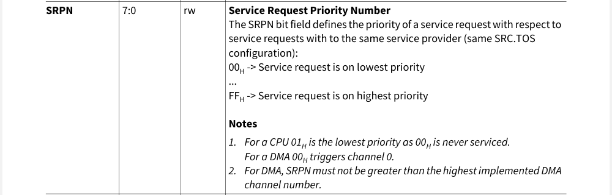

# Getting Started with AURIX by Example of ERU_Interrupt_TC375

## 目的

这个例程比较简单，这里直接就放了官方例程，通过 `ERU` 实现外部中断功能，这个文档中增加一些说明。一些更为基础的资料等内容可以参考下面文章：

[《英飞凌 AURIX TriCore 单片机开发入门》](https://blog.csdn.net/Naisu_kun/article/details/136997615)

本文中例程基于英飞凌官方 [KIT_A2G_TC375_LITE](https://www.infineon.com/cms/en/product/evaluation-boards/kit_a2g_tc375_lite/) 开发板运行测试。

## 基础说明

基础说明其实官方例程中的 [文档](https://github.com/Infineon/AURIX_code_examples/blob/master/code_examples/ERU_Interrupt_1_KIT_TC375_LK/README.md) 和代码中的注释讲的也比较清楚了。官方例程实现了外部引脚输入，上升沿和下降沿都触发中断，在中断中翻转IO口。用飞线连接下图两个点，然后按下按键就可以看到LED状态翻转。




TC3XX的SCU模块下的ERU模块可以支持外部信号输入来触发一些信号输出，可以用来实现外部中断功能。该模块有8个输入通道和8个输出通道。总体配置就是选择输入通道与事件配置，关联配置到输出通道，并指定输出触发规则和行为。


> - Initialize external request pin (*IfxScuEru_initReqPin()*)
> - Select which edge should trigger the interrupt (*IfxScuEru_enableRisingEdgeDetection()* and/or *IfxScuEru_enableFallingEdgeDetection()*)
> - Enable generation of trigger events with the function *IfxScuEru_enableTriggerPulse()*
> - Choose the output channel by selecting the Output Gating Unit (OGUz) and the trigger pulse output (TRxz)
>   - An event from the Event Trigger Logic (ETL0) triggers the OGU0 (signal TRx0). The function *IfxScuEru_connectTrigger()* determines the output channel for the trigger event
> - Select the condition to generate an interrupt with the function *IfxScuEru_setInterruptGatingPattern()*
> - Configure and enable the service request with the functions *IfxSrc_init()* and *IfxSrc_enable()*





## 中断回调函数设置

TC3XX总共支持1024个中断请求，每个中断控制核心最多支持255个请求。中断回调函数由下面宏进行设置：

```c
/* Macro to define Interrupt Service Routine.
 *
 * IFX_INTERRUPT(isr, vectabNum, priority)
 *  - isr: Name of the ISR function.
 *  - vectabNum: Vector table number.
 *  - priority: Interrupt priority. Refer Usage of Interrupt Macro for more details.
 */
IFX_INTERRUPT(isr, vectabNum, priority);
```

向量表编号选项如下（注意中间插了DMA）：



中断优先级如下，编号越大优先级越高。对于CPU而言优先级0是不启用；对于DMA而言0是通道0，另最大不能超过DMA通道数：




## 总结

`ERU` 模块使用比较简单，这里就演示到此了。


